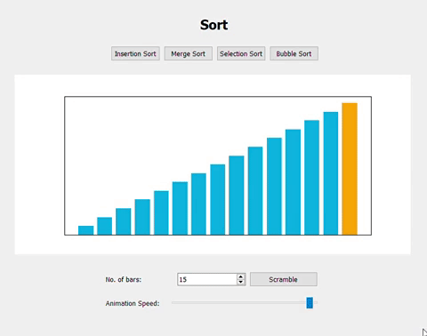
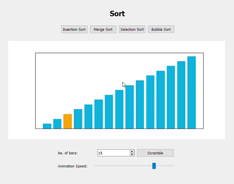
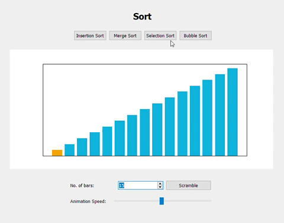
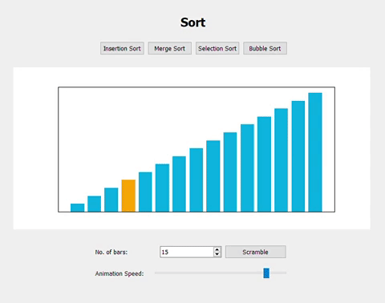

# Sort-and-Shuffle
A Python program that visualize different sorting algorithms, and shuffling algorithm. Visualized with PyQt.

## Selection Sort:
    Selection sort algorithm sorts an array by repeatedly finding the minimum element (considering ascending order) from unsorted part and putting it at the beginning.

## Insertion Sort:
    Insertion sort is the sorting mechanism where the sorted array is built having one item at a time. The array elements are compared with each other sequentially and then arranged simultaneously in some particular order.

## Merge Sort:
    Merge Sort is a Divide and Conquer algorithm. It divides input array in two halves, calls itself for the two halves and then merges the two sorted halves.

## Bubble Sort:
    Bubble sort is a simple sorting algorithm that repeatedly steps through the list, compares adjacent elements and swaps them if they are in the wrong order. The pass through the list is repeated until the list is sorted.
    

